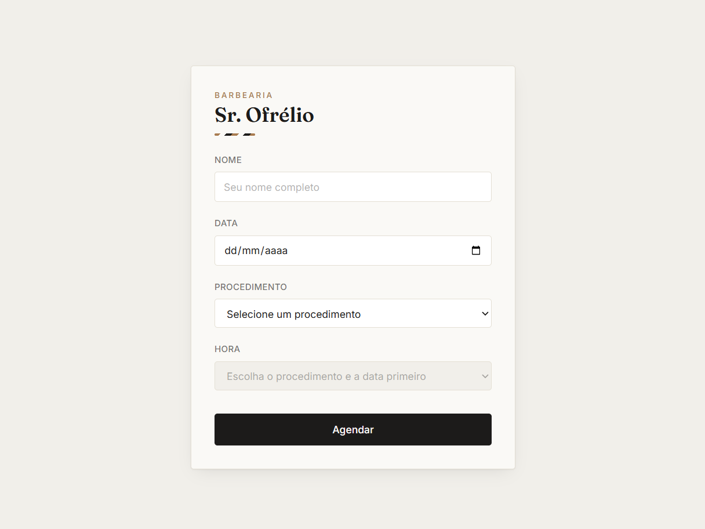
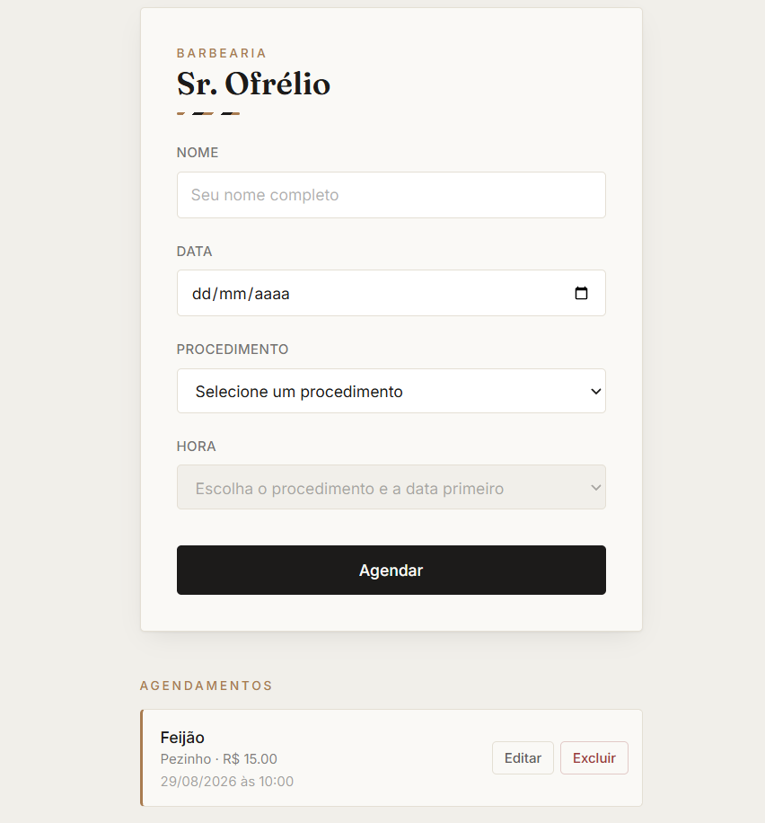

# Barbearia Sr. Ofrélio

Sistema de agendamento online para barbearia — o cliente marca o próprio horário, e o barbeiro gerencia tudo em um painel administrativo.

**[Acessar demo ao vivo →](https://barbearia-green-iota.vercel.app)**

> ⚠️ O backend e o banco de dados rodam em planos gratuitos (Render + Aiven), que "dormem" após um período de inatividade. Se a primeira requisição demorar 30–60 segundos ou os horários não carregarem de primeira, aguarde um instante e tente novamente.

## Capturas de tela

<table>
<tr>
<td align="center" width="50%"><strong>Agendamento (cliente)</strong><br></td>
<td align="center" width="50%"><strong>Painel administrativo</strong><br></td>
</tr>
</table>

## Funcionalidades

**Área do cliente**
- Agendamento sem necessidade de login ou cadastro
- Cálculo automático de horários disponíveis, considerando a duração de cada procedimento
- Bloqueio de conflitos de horário em tempo real

**Painel do administrador**
- Login protegido por autenticação JWT
- Listagem, edição e exclusão de agendamentos
- Sessão expira automaticamente após 8h, com redirecionamento para o login

## Tecnologias

- **Frontend** — React · Vite · React Router · Tailwind CSS
- **Backend** — Node.js · Express · MySQL (mysql2)
- **Autenticação** — JWT · bcrypt
- **Infraestrutura** — Vercel (frontend) · Render (backend) · Aiven (MySQL)

## Segurança

- Senhas de admin com hash bcrypt; nunca armazenadas em texto puro
- Queries parametrizadas em 100% dos acessos ao banco (proteção contra SQL Injection)
- CORS restrito à origem do frontend em produção
- Rate limiting nas rotas de login e criação de agendamento, contra força bruta e spam
- Cálculo de datas e horários sempre no fuso de São Paulo, independente de onde o servidor esteja hospedado

## Rodando localmente

Pré-requisitos: Node.js 18+ e um banco MySQL (local ou na nuvem).

```bash
# Clonar o repositório
git clone https://github.com/agripe049/barbearia.git
cd barbearia

# Backend
cd backend
npm install
cp .env.example .env    # preencha com suas credenciais de banco e as chaves de autenticação
npm run dev

# Frontend (em outro terminal)
cd frontend/barbearia
npm install
cp .env.example .env    # aponte VITE_API_URL para o backend local
npm run dev
```

O backend sobe em `http://localhost:3000` e o frontend em `http://localhost:5173`.

## Estrutura do projeto

```
barbearia/
├── backend/           # API REST (Express + MySQL)
│   ├── app.js
│   └── data/
└── frontend/
    └── barbearia/      # SPA React
        └── src/
            ├── components/
            ├── pages/
            ├── routes/
            └── services/
```

---

Desenvolvido por Matheus · [LinkedIn](https://linkedin.com/in/matheus-agripe) · [GitHub](https://github.com/agripe049)
